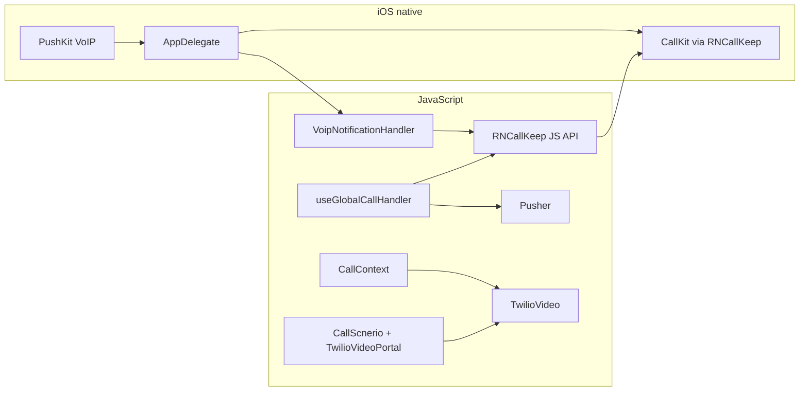

# Audio & video calling: CallKeep, VoIP push, native layers, and Agora porting

This document is derived from the **PrjNetwork** React Native codebase (React Native 0.72). It explains how **system call UI**, **wake-up when the app is dead**, **in-call audio/video behavior**, and **WebRTC media** fit together. Use it when integrating a similar stack elsewhere—**including replacing Twilio Video with Agora**.

For a shorter, Twilio-centric map, see [`CALLING_INTEGRATION_GUIDE.md`](./CALLING_INTEGRATION_GUIDE.md).

---

## 1. Separation of concerns (what you reuse vs what you swap)

| Layer | Role | In this project | When moving to Agora |
|--------|------|-----------------|----------------------|
| **Native call UI** | Incoming/outgoing surfaces, lock screen, Bluetooth | `react-native-callkeep` → CallKit (iOS) / ConnectionService (Android) | **Keep**; same APIs |
| **iOS wake for incoming** | Deliver payload before JS is ready | PushKit + native `reportNewIncomingCall` | **Keep**; payload shape must match your backend |
| **JS VoIP bridge** | Token + events to JS | `react-native-voip-push-notification` | **Keep** |
| **Android killed wake** | Show full-screen incoming without Pusher | FCM data message + CallKeep background service + headless JS | **Implement** (see §7) |
| **Realtime signaling (app alive)** | “Someone is calling you” + hangup | Pusher WebSocket | **Replace** with your channel (Socket.IO, RTM, FCM-only, etc.) |
| **Media** | Encode/decode A/V, rooms | `react-native-twilio-video-webrtc` | **Replace** with `react-native-agora` (or similar) |
| **Audio route / proximity** | Speaker vs earpiece, in-call mode | `react-native-incall-manager` | **Keep** (or Agora’s built-ins + IncallManager) |
| **Screen on during video** | Prevent dim/lock mid-call | `@sayem314/react-native-keep-awake` | **Keep** for video UX |

**CallKeep and VoIP push are not tied to Twilio or Agora.** They only need a stable **call UUID** and consistent **answer / end** handling. Agora joins happen **after** the user accepts and your JS has tokens/channel IDs.

---

## 2. NPM packages involved in calling

| Package | Purpose |
|---------|---------|
| `react-native-callkeep` | CallKit / ConnectionService; `displayIncomingCall`, `startCall`, `answerIncomingCall`, `endCall`, event listeners |
| `react-native-voip-push-notification` | JS side of PushKit: register token, `notification`, `didLoadWithEvents`, `onVoipNotificationCompleted` |
| `@sayem314/react-native-keep-awake` | `activateKeepAwake` / `deactivateKeepAwake` during connected **video** calls |
| `react-native-incall-manager` | `setSpeakerphoneOn`, in-call audio behavior (used heavily in `CallContext` and `CallScnerio`) |
| `react-native-twilio-video-webrtc` | **Replace with Agora** for media only |
| `@pusher/pusher-websocket-react-native` | Incoming call + status while JS process runs |
| `react-native-onesignal` | Push user id; device token upload alongside VoIP token |
| `react-native-push-notification` | FCM listener service declared in Android manifest (pairs with CallKeep’s background messaging path) |
| `@notifee/react-native` | General notifications (badges, local tests)—**not** the primary incoming-call ring in this app |

---

## 3. End-to-end architecture



- **iOS killed/background:** CallKit is updated from **native** (`AppDelegate`) as soon as the VoIP push arrives; JS catches up afterward.
- **Foreground:** VoIP still arrives; `VoipNotificationHandler` may call `displayIncomingCall` from JS; Pusher fills `incomingCall` state when both align on UUID.

---

## 4. Entry points and configuration

`index.js` runs **before** the root `App` component mounts. It owns **global** CallKeep registration, the Android headless task name, and **iOS-only** VoIP listener bootstrap. `App.js` runs when the UI tree starts; in this project it performs a **second** `RNCallKeep.setup` on **Android only** (foreground service + permissions) and **AppState** cleanup that affects outgoing ringback—not the native incoming push path.

---

### 4.1 `index.js` — what each block does

| Block | Platform | Role |
|-------|----------|------|
| **`callKeepOptions`** | Both (passed to `setup`) | **iOS:** `appName`, `includesCallsInRecents`, `supportsVideo`. **Android:** permission alert copy, `additionalPermissions: []` here (extra perms are applied in `App.js` on Android). |
| **`AppRegistry.registerHeadlessTask('RNCallKeepBackgroundMessage', …)`** | **Android** | Registers the JS handler CallKeep’s **background messaging service** can invoke when a push wakes the app **without** the main UI. Name must stay **`RNCallKeepBackgroundMessage`**. In this repo the handler only logs—**implement** `RNCallKeep.displayIncomingCall` (and any setup) here for killed-state incoming (see §7). |
| **`RNCallKeep.setup(callKeepOptions)`** | Both | First JS-side CallKeep init. Runs at cold start so CallKit / ConnectionService APIs exist as soon as the bundle loads. |
| **`voipNotificationHandler.init()`** | **iOS only** | Wires `react-native-voip-push-notification` (`notification`, `didLoadWithEvents`) to centralized parsing. |
| **`voipNotificationHandler.addCallback(… displayIncomingCall …)`** | **iOS only** | When JS receives a VoIP payload (foreground or after launch), calls **`RNCallKeep.displayIncomingCall`** (or `endCall` if ended). Complements **native** `reportNewIncomingCall` in `AppDelegate`; use one coherent UUID strategy to avoid duplicate CallKit UI (§4.4, §7.1). |
| **`VoipPushNotification.addEventListener('register', …)`** | **iOS only** | Logs token; **actual upload** to backend is done in `NetworkHomeScreen.js` after `registerVoipToken()`. |
| **`AppRegistry.registerComponent(appName, () => App)`** | Both | Mounts `App.js` after the above ran. |

**Why `index.js` matters for background**

- **iOS:** VoIP events delivered to JS while the app is backgrounded or just became active still go through `VoipNotificationHandler`; native CallKit is already shown from PushKit in `AppDelegate` when the process was woken from killed state.
- **Android:** The **only** JS entry that runs without `App` mounting for incoming-call pushes is the **headless task** registered here. `App.js`’s `useEffect` does **not** run in that scenario.

---

### 4.2 `App.js` — calling-related behavior

| Block | Platform | Role |
|-------|----------|------|
| **`RNCallKeep.setup(callKeepOptions)` inside `useEffect`** | **Android only** | Second setup pass: supplies **`foregroundService`** (`channelId`, `channelName`, `notificationTitle`, `notificationIcon`) using `CHANEL` from `AppEnumData`—required so **ConnectionService** can run a **foreground service** during calls. Also sets **`additionalPermissions`** for `RECORD_AUDIO`, `CALL_PHONE`, `READ_PHONE_STATE` (the dialog CallKeep uses for phone-account / telecom flows). Nested `ios` keys in this object are unused when `Platform.OS === 'android'`. |
| **AppState listener** | Both | On **background/inactive**, stops **dial tone / ringback** (`dialToneManager.forceStop`, `forceStopDialTone`) so outgoing-call audio does not leak when the user leaves the app. On return to **active**, sets a short “just resumed” flag for other features—not CallKeep-specific. |
| **Cleanup on unmount** | Both | `dialToneManager.cleanup`, `forceStopDialTone`. |

**What `App.js` does *not* do**

- It does **not** register VoIP, FCM, or CallKeep event listeners for answer/end (those live in **`useGlobalCallHandler`** via `AppProvider`).
- It does **not** replace `index.js` setup on iOS—iOS only runs Purchases in this file for calling-adjacent config.

**Consolidation tip for a new project:** Prefer **one** `RNCallKeep.setup` per platform with merged options (iOS keys from `index.js` + Android `foregroundService` + permissions from `App.js`) to avoid mismatched `supportsVideo` / `appName` across files and native `AppDelegate`.

---

### 4.3 Other JS/native pieces that affect “background calling”

| Piece | iOS | Android |
|-------|-----|---------|
| **`src/utils/VoipNotificationHandler.js`** | Parses VoIP payload, `displayIncomingCall` / `endCall`, `onVoipNotificationCompleted`. | Not used (VoIP is iOS). |
| **`src/hooks/useGlobalCallHandler.js`** (via `AppContext`) | `RNCallKeep.addEventListener('answerCall' \| 'endCall')`, Pusher when JS alive, merges VoIP UUID with incoming call state. | Same listeners; Pusher when process alive. |
| **`ios/…/AppDelegate.mm`** | PushKit → **`reportNewIncomingCall`** (killed/background safe). | — |
| **`AndroidManifest.xml`** | — | `VoiceConnectionService`, `RNCallKeepBackgroundMessagingService`, FCM listener if used. |
| **`NetworkHomeScreen.js`** | `registerVoipToken` + upload `voip_token` to backend. | Device token / OneSignal only as needed. |

---

### 4.4 Background vs killed — who is responsible?

| Scenario | iOS — show incoming UI | iOS — JS state / navigate on answer | Android — show incoming UI | Android — JS state |
|----------|------------------------|-------------------------------------|----------------------------|-------------------|
| **Foreground** | Often **native** PushKit → CallKit **and/or** JS `displayIncomingCall` via `VoipNotificationHandler` | `useGlobalCallHandler` + Pusher | JS `displayIncomingCall` when your signaling delivers (e.g. Pusher) | Same |
| **Background** | **`AppDelegate`** `reportNewIncomingCall` (primary); JS may catch up with VoIP events | VoIP + Pusher when awakened | FCM + CallKeep service → often headless **`RNCallKeepBackgroundMessage`** (must implement) | Headless or main JS after wake |
| **Killed** | **`AppDelegate`** `reportNewIncomingCall` before bridge is ready | After user answers, app launches → `didLoadWithEvents` / listeners + stored payload | FCM → **`RNCallKeepBackgroundMessagingService`** → headless task in **`index.js`** (stub in this repo) | After full launch + `useGlobalCallHandler` |

**Summary:** **iOS** relies on **native `AppDelegate`** for reliable incoming UI when the app is not in the foreground; **`index.js`** + **`VoipNotificationHandler`** keep JS aligned. **Android** relies on **manifest services** + **`index.js` headless task** for killed wake-up; **`App.js`** configures the **foreground service** channel so ongoing ConnectionService calls are valid on modern APIs.

---

### 4.5 iOS `AppDelegate.mm`

- Creates `PKPushRegistry`, sets VoIP type, calls `[RNVoipPushNotificationManager voipRegistration]`.
- Calls `[RNCallKeep setup:...]` again with native dictionary (`supportsVideo` here is `@NO` in this repo—**intentionally align** with JS for production).
- On VoIP push: parses payload, then **`[RNCallKeep reportNewIncomingCall:... fromPushKit:YES ...]`** (critical for killed state).
- Optionally emits `RCTDeviceEventEmitter` → `voipRemoteNotificationReceived` if bridge exists.
- Forwards payload to `RNVoipPushNotificationManager` for the RN library.

### 4.6 Android `AndroidManifest.xml`

- `io.wazo.callkeep.VoiceConnectionService` with `foregroundServiceType="camera|microphone"`.
- `io.wazo.callkeep.RNCallKeepBackgroundMessagingService`.
- Telecom, phone, foreground service, microphone, camera permissions as required by target API.

### 4.7 `Info.plist` (`UIBackgroundModes`)

Includes at least **`voip`** and **`audio`** (plus `remote-notification`, etc.) so PushKit and in-call audio behave correctly.

---

## 5. VoIP payload contract (backend → APNs → native + JS)

Align pushes with what **native** (`AppDelegate.mm`) and **JS** (`VoipNotificationHandler.js`, `useGlobalCallHandler.js`) expect:

| Key | Usage |
|-----|--------|
| `uuid` | CallKit UUID; native generates one if missing |
| `callerName` | Display name |
| `handle` | CallKit handle; fallbacks: `callerData.phone`, `phoneNumber`, `phone_number`, or `network-{callerId}` |
| `callerId` / `caller_id` | Fallbacks for handle |
| `callType` | `audio`, `video`, or `video_call` |
| `callerData` | Nested phone fields |
| `callStatus` | In JS, `ended` can trigger `RNCallKeep.endCall` |

**VoIP token upload:** After login, `NetworkHomeScreen` registers `VoipPushNotification.registerVoipToken()` (delayed so listeners exist), listens for `register`, and POSTs `phone`, `device_token` (OneSignal id), and `voip_token` to `SAVE_DEVICE_TOKEN`.

---

## 6. Call event handling in JavaScript

### 6.1 `VoipNotificationHandler` (`src/utils/VoipNotificationHandler.js`)

- Subscribes to `notification` and `didLoadWithEvents`.
- Normalizes payload into `callUUID`, `callerName`, `handle`, `callType`, etc., and notifies registered callbacks.
- Calls `VoipPushNotification.onVoipNotificationCompleted(uuid)` when appropriate (Apple’s VoIP completion contract).
- `displayIncomingCall`: `RNCallKeep.displayIncomingCall` or `endCall` if `callStatus === 'ended'`.

### 6.2 `useGlobalCallHandler` (`src/hooks/useGlobalCallHandler.js`)

- Registers a **foreground** VoIP callback on the same handler to populate `incomingCall` and `callUUIDRef`.
- **Pusher** `create-call`: matches `receiverId`; prefers an existing `callUUIDRef` from VoIP (waits up to ~1s if needed). Does **not** call `displayIncomingCall` from Pusher (commented)—CallKit is expected from VoIP/native.
- **Pusher** `calling-request`: on `ENDED`, `RNCallKeep.endCall`, clears state.
- **Persistent** `RNCallKeep.addEventListener('answerCall' | 'endCall')` → `acceptCall` / `declineCall` → navigate to call screen, update backend status, `answerIncomingCall` when accepting.

### 6.3 `CallContext` (`src/context/CallContext.js`)

- **Outgoing (iOS):** `RNCallKeep.startCall` with a new UUID; on room connect, `reportConnectedOutgoingCallWithUUID` (or fallbacks); on end, `endCall`.
- **Media:** Twilio token from `CREATE_JOIN_CALL`, `TwilioVideo` ref, connect/disconnect, tracks, speaker/receiver via `InCallManager`.
- **Audio:** Short delay before `connectToCall` on Android/iOS so ringback and audio session settle.

### 6.4 `TwilioVideoPortal` (`src/TwilioVideoPortal.js`)

- Renders hidden `TwilioVideo` + tiny local preview at root (`AppContent`) so the ref survives navigation—**same pattern for Agora**: mount `RtcSurfaceView` / engine at root and keep one engine instance.

### 6.5 `CallScnerio.js` (call UI)

- Subscribes to Pusher `calling-request` for remote hangup → `RNCallKeep.endCall`, `disconnectCall`, navigate back.
- **`react-native-incall-manager`:** `setSpeakerphoneOn(isSpeakerOn)` when tracks/speaker state change.
- **`@sayem314/react-native-keep-awake`:** When `callStatus === 'connected'` and `callType === 'video'`, `activateKeepAwake()`; otherwise `deactivateKeepAwake()`; cleanup on unmount.
- AppState: on return to foreground, restart local video (iOS vs Android branches).
- `CustomCallModal` listens to `didChangeAudioRoute` from CallKeep for UI consistency.

---

## 7. Killed vs background vs foreground

### 7.1 iOS

| App state | Incoming UI | Signaling |
|-----------|-------------|-----------|
| Foreground | Native CallKit from PushKit path + JS VoIP handler | VoIP + Pusher |
| Background | **`reportNewIncomingCall` in AppDelegate** (before JS) | VoIP required; Pusher unreliable until wake |
| Killed (swiped away) | Same as background: PushKit wakes process briefly; CallKit from native | VoIP required |

**Critical:** Native must call `reportNewIncomingCall` with **`fromPushKit: YES`** quickly. JS then completes VoIP work and navigates on answer.

**Caveat:** Duplicate CallKit presentation can occur if both native and JS call `displayIncomingCall` for the same logical call—coordinate UUIDs and prefer **one** path per state if you refactor.

### 7.2 Android

| App state | Incoming UI | Signaling |
|-----------|-------------|-----------|
| Foreground | ConnectionService when JS calls `displayIncomingCall` | Pusher + optional FCM |
| Background | Often FCM high-priority data + CallKeep service | Pusher may die |
| Killed | **Requires** FCM → `RNCallKeepBackgroundMessagingService` → headless task **`RNCallKeepBackgroundMessage`** | Pusher **not** running |

In this repo, `RNCallKeepBackgroundMessage` in `index.js` only logs and resolves—it does **not** call `displayIncomingCall`. For production parity with iOS, implement the headless handler per current `react-native-callkeep` Android docs (payload fields, permissions, full-screen intent rules on newer APIs).

**Missed-call fallback:** OneSignal `missed_call` in `AppContent` navigates after user tap—not a substitute for live ringing.

---

## 8. Porting to Agora (checklist)

1. **Keep** CallKeep setup (consolidate duplicate `setup` calls to one source of truth per platform).
2. **Keep** PushKit + `reportNewIncomingCall` in `AppDelegate` (or Swift equivalent).
3. **Keep** `VoipNotificationHandler` + global `answerCall` / `endCall` listeners; only change how you resolve **tokens / channel / uid** after accept.
4. **Replace** `TwilioVideoPortal` + `CallContext` Twilio methods with:
   - `createAgoraRtcEngine`, `joinChannel` with token from your API,
   - local/remote `RtcSurfaceView` (or Agora UI kit),
   - event mapping: `onJoinChannelSuccess`, `onUserJoined`, `onUserOffline`, etc.
5. **Keep** `InCallManager` for route control unless Agora + platform cover all cases.
6. **Keep** `@sayem314/react-native-keep-awake` on connected video if you want screen-on behavior.
7. **Android killed:** Implement `RNCallKeepBackgroundMessage` + server FCM payload; test on OEM devices.
8. **Backend:** Issue Agora tokens (RTC) on create/accept call; continue sending VoIP pushes with the **same UUID** your JS uses for `answerIncomingCall` / `endCall`.

---

## 9. File map (quick reference)

| Topic | Path |
|--------|------|
| First `RNCallKeep.setup`, **`RNCallKeepBackgroundMessage` headless task**, iOS `VoipNotificationHandler` + token listener | `index.js` (§4.1) |
| Android-only second `RNCallKeep.setup` (foreground service channel + permissions); AppState stops dial tone on background | `App.js` (§4.2) |
| VoIP normalization + `displayIncomingCall` | `src/utils/VoipNotificationHandler.js` |
| Pusher + CallKeep answer/end | `src/hooks/useGlobalCallHandler.js` |
| Twilio + outgoing CallKit + IncallManager | `src/context/CallContext.js` |
| Root Twilio view (swap for Agora) | `src/TwilioVideoPortal.js`, mounted in `src/AppContent.js` |
| Call UI, keep-awake, Pusher hangup | `src/screens/callstab/CallScnerio.js` |
| VoIP token register + API upload | `src/screens/networktab/NetworkHomeScreen.js` |
| PushKit + CallKit native | `ios/PrjNetwork/AppDelegate.mm` |
| Background modes | `ios/PrjNetwork/Info.plist` |
| ConnectionService + background service | `android/app/src/main/AndroidManifest.xml` |

---

## 10. Maintenance notes

- **`RNCallKeep.setup` is invoked in three places** (`index.js`, `App.js` Android block, `AppDelegate.mm`) with slightly different options (`supportsVideo` mismatch between native and JS in this tree). For a new project or Agora app, **unify** configuration to avoid CallKit inconsistencies.
- **Apple VoIP policy:** VoIP pushes must drive real incoming-call UX; avoid using VoIP for generic notifications or risk throttling/kills.
- **Test matrix:** answer / decline × audio / video × (foreground, background, killed) on **physical** iOS and Android devices.

---

## 11. Drop-in native templates (any project)

Use these blocks in **another** React Native app so tooling (or a developer) can mirror this app’s call-handling pattern without opening PrjNetwork.

**Placeholders**

| Placeholder | Meaning |
|-------------|---------|
| `YourApp` | Short display name for CallKit (matches `appName` in JS `RNCallKeep.setup`) |
| `YourAppDelegate` | Your `AppDelegate` class name (often `AppDelegate`) |
| `YourIosTarget` | Xcode target / folder name (e.g. `MyApp`) |

**Prerequisites**

- `yarn` / `npm` install: `react-native-callkeep`, `react-native-voip-push-notification`
- iOS: `cd ios && pod install`
- Android: `minSdkVersion` and `compileSdkVersion` per CallKeep’s current readme

---

### 11.1 iOS — `Info.plist`

Inside the root `<dict>`, ensure **UIBackgroundModes** includes VoIP (and audio for calls):

```xml
<key>UIBackgroundModes</key>
<array>
  <string>voip</string>
  <string>audio</string>
  <string>remote-notification</string>
</array>
```

In Xcode: **Signing & Capabilities** → add **Background Modes** → enable **Voice over IP** and **Audio, AirPlay, and Picture in Picture** as needed; add **Push Notifications**.

---

### 11.2 iOS — `AppDelegate.h` (Objective-C)

Extend your interface with PushKit and (if not already) notification center delegate. Merge with your existing imports and protocols:

```objc
#import <UIKit/UIKit.h>
#import <UserNotifications/UserNotifications.h>
#import <PushKit/PushKit.h>

@interface AppDelegate : RCTAppDelegate <UNUserNotificationCenterDelegate, PKPushRegistryDelegate>
@property (nonatomic, strong) PKPushRegistry *voipRegistry;
@end
```

If you use the **classic** `UIApplicationDelegate` + `RCTBridge` pattern instead of `RCTAppDelegate`, keep your base class and only add `<PKPushRegistryDelegate>` and the `voipRegistry` property.

---

### 11.3 iOS — `AppDelegate.mm` (Objective-C): imports and VoIP + CallKeep

Add at top (with your other imports):

```objc
#import "RNCallKeep.h"
#import "RNVoipPushNotificationManager.h"
#import <PushKit/PushKit.h>
#import <React/RCTBridge.h>
#import <React/RCTEventDispatcher.h>
```

**In `application:didFinishLaunchingWithOptions:`** (after Firebase or other early setup, before showing UI is fine), add:

```objc
  // PushKit — VoIP token + incoming pushes
  self.voipRegistry = [[PKPushRegistry alloc] initWithQueue:dispatch_get_main_queue()];
  self.voipRegistry.delegate = self;
  self.voipRegistry.desiredPushTypes = [NSSet setWithObject:PKPushTypeVoIP];
  [RNVoipPushNotificationManager voipRegistration];

  // CallKeep (keep options aligned with index.js RNCallKeep.setup)
  [RNCallKeep setup:@{
    @"appName": @"YourApp",
    @"maximumCallGroups": @3,
    @"maximumCallsPerCallGroup": @1,
    @"supportsVideo": @YES
  }];
```

**PushKit token** (forwards token to `react-native-voip-push-notification`):

```objc
#pragma mark - PushKit (VoIP)

- (void)pushRegistry:(PKPushRegistry *)registry
    didUpdatePushCredentials:(PKPushCredentials *)credentials
                  forType:(PKPushType)type {
  if (!credentials.token) return;
  [RNVoipPushNotificationManager didUpdatePushCredentials:credentials forType:type];
}

- (void)pushRegistry:(PKPushRegistry *)registry
    didInvalidatePushTokenForType:(PKPushType)type {
  // Optional: log or notify JS
}
```

**Incoming VoIP push — report CallKit immediately (killed / background / foreground):**

```objc
- (void)pushRegistry:(PKPushRegistry *)registry
didReceiveIncomingPushWithPayload:(PKPushPayload *)payload
             forType:(PKPushType)type
withCompletionHandler:(void (^)(void))completion {

  NSDictionary *data = payload.dictionaryPayload ?: @{};
  NSString *uuid = data[@"uuid"] ?: [[[NSUUID UUID] UUIDString] lowercaseString];
  NSString *callerName = data[@"callerName"] ?: @"Unknown Caller";

  NSString *handle = data[@"handle"];
  if (!handle || [handle isEqualToString:@"Unknown"] || [handle isEqualToString:@"unknown"]) {
    NSDictionary *callerData = data[@"callerData"];
    if (callerData) {
      handle = callerData[@"phone"] ?: callerData[@"phoneNumber"] ?: callerData[@"phone_number"];
    }
    if (!handle || [handle isEqualToString:@"Unknown"] || [handle isEqualToString:@"unknown"]) {
      handle = data[@"phone"] ?: data[@"phoneNumber"] ?: data[@"phone_number"];
    }
    if (!handle || [handle isEqualToString:@"Unknown"] || [handle isEqualToString:@"unknown"]) {
      NSString *callerId = data[@"callerId"] ?: data[@"caller_id"];
      handle = callerId ? [NSString stringWithFormat:@"app-%@", callerId] : @"Unknown";
    }
  }

  NSString *callType = data[@"callType"] ?: @"audio";
  BOOL hasVideo = [callType isEqualToString:@"video"] || [callType isEqualToString:@"video_call"];

  [RNCallKeep reportNewIncomingCall:uuid
                             handle:handle
                          handleType:@"number"
                            hasVideo:hasVideo
                 localizedCallerName:callerName
                     supportsHolding:YES
                        supportsDTMF:YES
                    supportsGrouping:YES
                  supportsUngrouping:YES
                         fromPushKit:YES
                             payload:nil
               withCompletionHandler:nil];

  // Optional: notify JS when bridge is up (same event name your JS listens for, if any)
  RCTBridge *bridge = self.bridge;
  if (bridge) {
    NSArray *args = @[ @"voipRemoteNotificationReceived", data ];
    [bridge enqueueJSCall:@"RCTDeviceEventEmitter"
                   method:@"emit"
                     args:args
               completion:NULL];
  }

  [RNVoipPushNotificationManager didReceiveIncomingPushWithPayload:payload forType:type];

  if (completion) {
    completion();
  }
}
```

**Notes**

- If `reportNewIncomingCall` signature differs in your CallKeep version, open `node_modules/react-native-callkeep/ios/RNCallKeep/RNCallKeep.h` and match it.
- **RCTAppDelegate** (RN 0.73+): `self.bridge` may be exposed differently—use your template’s bridge accessor (e.g. `[RCTBridge currentBridge]` patterns are discouraged; prefer the bridge your `AppDelegate` owns).
- Avoid duplicate CallKit UI: if native always reports the call, JS can skip `displayIncomingCall` for the same `uuid` when already shown.

---

### 11.4 iOS — Swift `AppDelegate` (if your project is Swift)

1. Add **Bridging Header** and include:

```objc
#import <RNCallKeep/RNCallKeep.h>
#import "RNVoipPushNotificationManager.h"
```

(Exact import paths may vary; use Xcode autocomplete after pod install.)

2. Implement `PKPushRegistryDelegate` with the same logic as §11.3 (call `RNCallKeep.reportNewIncomingCall` with `fromPushKit: YES`, then `RNVoipPushNotificationManager.didReceiveIncomingPushWithPayload`).

3. Enable Push Notifications + Background Modes as in §11.1.

---

### 11.5 Android — `AndroidManifest.xml`

Merge inside `<manifest>` (adjust `package` / nothing here is package-specific except your app block is already under `<application>`).

**Permissions** (add alongside your existing uses-permission list):

```xml
    <uses-permission android:name="android.permission.BIND_TELECOM_CONNECTION_SERVICE" />
    <uses-permission android:name="android.permission.FOREGROUND_SERVICE" />
    <uses-permission android:name="android.permission.CALL_PHONE" />
    <uses-permission android:name="android.permission.READ_PHONE_STATE" />
    <uses-permission android:name="android.permission.RECORD_AUDIO" />
    <uses-permission android:name="android.permission.CAMERA" />
    <uses-permission android:name="android.permission.FOREGROUND_SERVICE_MICROPHONE" />
    <uses-permission android:name="android.permission.FOREGROUND_SERVICE_CAMERA" />
    <uses-permission android:name="android.permission.WAKE_LOCK" />
```

**Inside `<application>`** (sibling to your `MainActivity`):

```xml
        <service
            android:name="io.wazo.callkeep.VoiceConnectionService"
            android:exported="true"
            android:label="YourApp"
            android:permission="android.permission.BIND_TELECOM_CONNECTION_SERVICE"
            android:foregroundServiceType="camera|microphone">
            <intent-filter>
                <action android:name="android.telecom.ConnectionService" />
            </intent-filter>
        </service>

        <service
            android:name="io.wazo.callkeep.RNCallKeepBackgroundMessagingService"
            android:exported="false" />
```

**FCM** (needed if you wake the app from killed for incoming calls): declare a listener that CallKeep can route through—commonly `react-native-push-notification`’s service (match your project’s FCM setup):

```xml
        <service
            android:name="com.dieam.reactnativepushnotification.modules.RNPushNotificationListenerService"
            android:exported="false">
            <intent-filter>
                <action android:name="com.google.firebase.MESSAGING_EVENT" />
            </intent-filter>
        </service>
```

On **Android 12+**, review **full-screen intent** and **USE_FULL_SCREEN_INTENT** permission for incoming-call UI; follow current `react-native-callkeep` + Android telecom docs.

---

### 11.6 Android — `MainApplication` / Kotlin

**No extra Java/Kotlin is required** for CallKeep if autolinking is on (typical RN). This app’s `MainApplication` only adds unrelated packages (e.g. Twilio). Your Agora app omits Twilio manual packages unless the Agora SDK needs one.

---

### 11.7 JS companion (same pattern as `index.js`)

Register the headless task name **exactly** as CallKeep expects:

```javascript
import { AppRegistry } from 'react-native';
import RNCallKeep from 'react-native-callkeep';

AppRegistry.registerHeadlessTask('RNCallKeepBackgroundMessage', () => async (data) => {
  // data: { name, callUUID, handle, ... } — shape depends on FCM payload mapping
  // await RNCallKeep.setup(...) if needed in headless context per library docs
  // RNCallKeep.displayIncomingCall(callUUID, handle, localizedCallerName, 'number', hasVideo);
  return Promise.resolve();
});
```

Implement `displayIncomingCall` here for **Android killed state** once your FCM data message supplies `callUUID`, handle, name, and video flag.

---

### 11.8 Verification checklist (native)

| Step | iOS | Android |
|------|-----|---------|
| Build | Archive succeeds, PushKit entitlement | Release build with telecom permissions |
| Incoming (foreground) | CallKit appears, JS receives VoIP event | ConnectionService UI from JS or FCM path |
| Incoming (killed) | CallKit from `reportNewIncomingCall` before JS | Headless task + FCM wired |
| Answer | `answerCall` fires in JS | Same |
| End | `endCall` clears native UI | Same |

---

*Document generated from PrjNetwork as of the codebase review; verify against your pinned `react-native-callkeep` / `react-native-voip-push-notification` versions and Agora SDK when implementing.*
